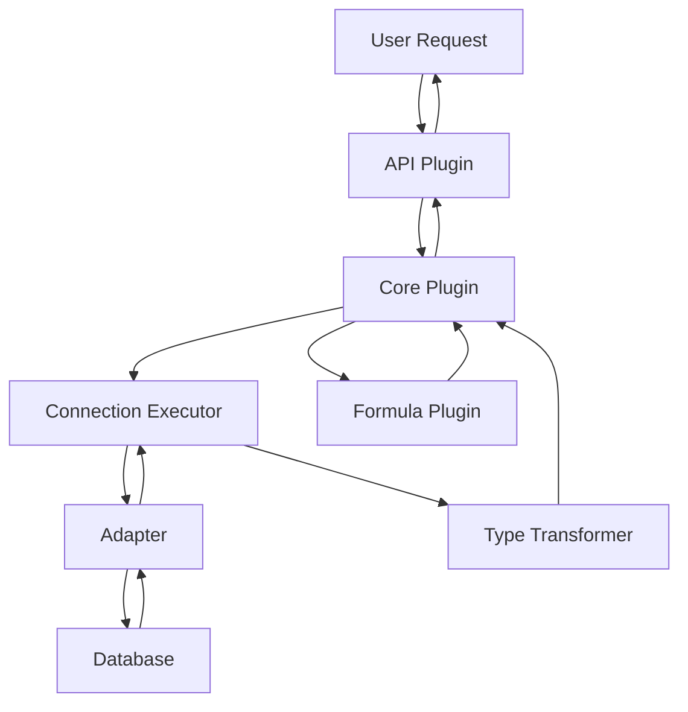

# Optimal Plan for Creating a New DataLens Connector

This guide provides a comprehensive, step-by-step plan for creating a new SQL-based connector for DataLens. It is based on analysis of existing connectors (particularly Trino, PostgreSQL, BigQuery, and Snowflake) and the DataLens plugin architecture.

## Table of Contents

1. [Prerequisites and Planning](#prerequisites-and-planning)
2. [Package Structure Setup](#package-structure-setup)
3. [Core Plugin Implementation](#core-plugin-implementation)
4. [API Plugin Implementation](#api-plugin-implementation)
5. [Formula Plugin Implementation](#formula-plugin-implementation)
6. [Localization](#localization)
7. [Testing Infrastructure](#testing-infrastructure)
8. [Integration](#integration)
9. [Documentation](#documentation)
10. [Validation Checklist](#validation-checklist)
11. [Suggested Improvements to KB](#suggested-improvements-to-kb)

---

## Prerequisites and Planning

### Step 1: Identify Your Data Source

Before starting implementation, gather the following information:

- **Data source name**: e.g., "MyDatabase"
- **SQLAlchemy dialect availability**: Check if a SQLAlchemy dialect exists for your data source
  - If yes: Use the existing dialect (preferred)
  - If no: You may need to create a custom SQLAlchemy dialect first
- **Connection parameters**: host, port, authentication methods, SSL options, etc.
- **Data type mappings**: How the source's native types map to DataLens types
- **SQL dialect specifics**: Any special SQL syntax or limitations

### Step 2: Choose Reference Connectors

Select 1-2 existing connectors as references based on similarity:

- **For standard SQL databases**: Use [`dl_connector_postgresql`](../../lib/dl_connector_postgresql) or [`dl_connector_mysql`](../../lib/dl_connector_mysql)
- **For cloud databases**: Use [`dl_connector_bigquery`](../../lib/dl_connector_bigquery) or [`dl_connector_snowflake`](../../lib/dl_connector_snowflake)
- **For query engines**: Use [`dl_connector_trino`](../../lib/dl_connector_trino)

### Step 3: Define Naming Conventions

Establish consistent naming throughout your connector:

```python
# Example for a connector named "MyDB"
CONNECTOR_NAME = "mydb"  # lowercase, used in paths and identifiers
CONNECTOR_DISPLAY_NAME = "MyDB"  # Display name for UI
CONNECTION_TYPE = "mydb"  # Connection type identifier
BACKEND_TYPE = "MYDB"  # Backend type (usually uppercase)
SOURCE_TYPE_TABLE = "MYDB_TABLE"
SOURCE_TYPE_SUBSELECT = "MYDB_SUBSELECT"
```

---

## Package Structure Setup

### Step 4: Create Package Directory Structure

Create the following directory structure under `mainrepo/lib/`:

```
dl_connector_mydb/
├── pyproject.toml
├── README.md
├── LICENSE
├── docker-compose.yml
├── dl_connector_mydb/
│   ├── __init__.py
│   ├── py.typed
│   ├── core/
│   │   ├── __init__.py
│   │   ├── constants.py
│   │   ├── connector.py
│   │   ├── us_connection.py
│   │   ├── dto.py
│   │   ├── target_dto.py
│   │   ├── adapters.py
│   │   ├── connection_executors.py
│   │   ├── type_transformer.py
│   │   ├── data_source.py
│   │   ├── data_source_migration.py (optional)
│   │   ├── settings.py
│   │   ├── query_compiler.py (optional)
│   │   ├── error_transformer.py (optional)
│   │   ├── conn_options.py (optional)
│   │   └── storage_schemas/
│   │       ├── __init__.py
│   │       └── connection.py
│   ├── api/
│   │   ├── __init__.py
│   │   ├── connector.py
│   │   ├── connection_info.py
│   │   ├── api_schema/
│   │   │   ├── __init__.py
│   │   │   └── connection.py
│   │   ├── connection_form/
│   │   │   ├── __init__.py
│   │   │   └── form_config.py
│   │   └── i18n/
│   │       ├── __init__.py
│   │       └── localizer.py
│   ├── formula/
│   │   ├── __init__.py
│   │   ├── connector.py
│   │   ├── constants.py
│   │   ├── literal.py
│   │   ├── type_constructor.py
│   │   └── definitions/
│   │       ├── __init__.py
│   │       ├── all.py
│   │       └── functions_*.py (multiple files)
│   ├── formula_ref/ (optional)
│   │   ├── __init__.py
│   │   ├── plugin.py
│   │   ├── human_dialects.py
│   │   └── i18n.py
│   ├── db_testing/
│   │   ├── __init__.py
│   │   ├── connector.py
│   │   └── engine_wrapper.py
│   ├── assets/
│   │   ├── __init__.py
│   │   └── icons/
│   │       ├── __init__.py
│   │       ├── standard/
│   │       │   ├── __init__.py
│   │       │   └── mydb.svg
│   │       └── nav/
│   │           ├── __init__.py
│   │           └── mydb.svg
│   └── locales/
│       ├── en/LC_MESSAGES/
│       │   ├── dl_connector_mydb.po
│       │   └── dl_connector_mydb.mo
│       └── ru/LC_MESSAGES/
│           ├── dl_connector_mydb.po
│           └── dl_connector_mydb.mo
├── dl_connector_mydb_tests/
│   ├── __init__.py
│   ├── db/
│   │   ├── __init__.py
│   │   ├── config.py
│   │   ├── conftest.py
│   │   ├── api/
│   │   ├── core/
│   │   └── formula/
│   └── unit/
│       ├── __init__.py
│       ├── conftest.py
│       └── test_*.py
└── docker-compose/
    └── Dockerfile.db-mydb
```

### Step 5: Configure pyproject.toml

See the [Trino connector's pyproject.toml](../../lib/dl_connector_trino/pyproject.toml) as a reference. Key sections:

- **Dependencies**: Include all required DataLens packages and database drivers
- **Plugins**: Register all four plugin types (core, api, formula, formula_ref)
- **Testing**: Configure pytest paths and mypy settings
- **i18n**: Define localization domains

---

## Core Plugin Implementation

The Core plugin handles connection management, query execution, and data type transformations.

### Step 6-15: Core Plugin Components

Implement the following components in order:

1. **Constants** ([`constants.py`](../../lib/dl_connector_trino/dl_connector_trino/core/constants.py)): Define connection types, source types, backend types
2. **DTOs** ([`dto.py`](../../lib/dl_connector_trino/dl_connector_trino/core/dto.py), [`target_dto.py`](../../lib/dl_connector_trino/dl_connector_trino/core/target_dto.py)): Data transfer objects for connection parameters
3. **Type Transformer** ([`type_transformer.py`](../../lib/dl_connector_trino/dl_connector_trino/core/type_transformer.py)): Map between database and DataLens types
4. **Adapters** ([`adapters.py`](../../lib/dl_connector_trino/dl_connector_trino/core/adapters.py)): Query execution adapters
5. **Connection Executors** ([`connection_executors.py`](../../lib/dl_connector_trino/dl_connector_trino/core/connection_executors.py)): Manage database connections
6. **Connection Class** ([`us_connection.py`](../../lib/dl_connector_trino/dl_connector_trino/core/us_connection.py)): Main connection implementation
7. **Data Sources** ([`data_source.py`](../../lib/dl_connector_trino/dl_connector_trino/core/data_source.py)): Table and subselect data sources
8. **Storage Schemas** ([`storage_schemas/connection.py`](../../lib/dl_connector_trino/dl_connector_trino/core/storage_schemas/connection.py)): Marshmallow schemas for persistence
9. **Settings** ([`settings.py`](../../lib/dl_connector_trino/dl_connector_trino/core/settings.py)): Connector configuration
10. **Core Connector** ([`connector.py`](../../lib/dl_connector_trino/dl_connector_trino/core/connector.py)): Assemble all core components

**Key Implementation Pattern:**
```python
# Each component follows this pattern:
# 1. Import base classes from dl_core
# 2. Import connector-specific dependencies
# 3. Implement the class with required methods
# 4. Register in the connector definition
```

---

## API Plugin Implementation

The API plugin defines REST API schemas, connection forms, and UI integration.

### Step 16: Create API Schemas

Create [`api/api_schema/connection.py`](../../lib/dl_connector_trino/dl_connector_trino/api/api_schema/connection.py):

```python
from marshmallow import fields as ma_fields
from dl_api_connector.api_schema.connection_base import ConnectionMetaMixin
from dl_api_connector.api_schema.connection_sql import ClassicConnectionSQL

class MyDBConnectionSchema(ConnectionMetaMixin, ClassicConnectionSQL):
    TARGET_CLS = ConnectionMyDB
    # Define all connection fields with proper validation
```

### Step 17: Create Connection Form

Create [`api/connection_form/form_config.py`](../../lib/dl_connector_trino/dl_connector_trino/api/connection_form/form_config.py):

This defines the UI form for creating/editing connections. Key components:
- Form field definitions
- Validation rules
- Conditional field visibility
- Default values

### Step 18: Create Connection Info Provider

Create [`api/connection_info.py`](../../lib/dl_connector_trino/dl_connector_trino/api/connection_info.py):

```python
from dl_api_connector.connection_info import ConnectionInfoProvider

class MyDBConnectionInfoProvider(ConnectionInfoProvider):
    title_translatable = Translatable("label_connector-mydb")
    # Set icon paths
```

### Step 19: Create Localizer

Create [`api/i18n/localizer.py`](../../lib/dl_connector_trino/dl_connector_trino/api/i18n/localizer.py):

```python
from dl_i18n.localizer_base import Localizer

class Translatable:
    # Define translation keys
    pass

CONFIGS = [
    # Translation configurations
]
```

### Step 20: Assemble API Connector

Create [`api/connector.py`](../../lib/dl_connector_trino/dl_connector_trino/api/connector.py):

```python
from dl_api_connector.connector import (
    ApiBackendDefinition,
    ApiConnectionDefinition,
    ApiConnector,
    ApiSourceDefinition,
)

class MyDBApiConnector(ApiConnector):
    backend_definition = MyDBApiBackendDefinition
    connection_definitions = (MyDBApiConnectionDefinition,)
    source_definitions = (...)
    translation_configs = frozenset(CONFIGS)
```

---

## Formula Plugin Implementation

The Formula plugin translates DataLens formulas to SQL for your database.

### Step 21: Define Formula Constants

Create [`formula/constants.py`](../../lib/dl_connector_trino/dl_connector_trino/formula/constants.py):

```python
from dl_formula.core.dialect import DialectCombo

class MyDBDialect(DialectCombo):
    MYDB = DialectCombo.MYDB  # Define dialect namespace

DIALECT_NAME_MYDB = "MYDB"
```

### Step 22: Implement Literalizer

Create [`formula/literal.py`](../../lib/dl_connector_trino/dl_connector_trino/formula/literal.py):

```python
from dl_formula.definitions.literals import Literalizer

class MyDBLiteralizer(Literalizer):
    # Customize how literals are rendered in SQL
    pass
```

### Step 23: Implement Type Constructor

Create [`formula/type_constructor.py`](../../lib/dl_connector_trino/dl_connector_trino/formula/type_constructor.py):

```python
from dl_formula.definitions.type_constructor import TypeConstructor

class MyDBTypeConstructor(TypeConstructor):
    # Map DataLens types to SQLAlchemy types
    pass
```

### Step 24: Define Formula Functions

Create multiple files in [`formula/definitions/`](../../lib/dl_connector_trino/dl_connector_trino/formula/definitions/):

- `functions_string.py`: String manipulation functions
- `functions_datetime.py`: Date/time functions
- `functions_aggregation.py`: Aggregation functions
- `functions_math.py`: Mathematical functions
- `operators_binary.py`: Binary operators (+, -, *, /, etc.)
- `operators_unary.py`: Unary operators (NOT, -, etc.)
- `all.py`: Collect all definitions

**Pattern for function definitions:**
```python
from dl_formula.definitions.base import TranslationVariant
from dl_formula.definitions.common import make_binary_chain

# Example: String concatenation
V.CONCAT = TranslationVariant.make(
    name="concat",
    body="CONCAT({0}, {1})",
)
```

### Step 25: Assemble Formula Connector

Create [`formula/connector.py`](../../lib/dl_connector_trino/dl_connector_trino/formula/connector.py):

```python
from dl_formula.connectors.base.connector import FormulaConnector

class MyDBFormulaConnector(FormulaConnector):
    dialect_ns_cls = MyDBDialect
    dialects = MyDBDialect.MYDB
    default_dialect = MyDBDialect.MYDB
    op_definitions = DEFINITIONS  # From all.py
    literalizer_cls = MyDBLiteralizer
    type_constructor_cls = MyDBTypeConstructor
    sa_dialect = SAMyDBDialect()  # SQLAlchemy dialect instance
```

---

## Localization

### Step 26: Create Translation Files

Create `.po` files in [`locales/en/LC_MESSAGES/`](../../lib/dl_connector_trino/dl_connector_trino/locales/en/LC_MESSAGES/) and `locales/ru/LC_MESSAGES/`:

```po
# dl_connector_mydb.po
msgid "label_connector-mydb"
msgstr "MyDB"

msgid "field_host"
msgstr "Host"

msgid "field_port"
msgstr "Port"

# Add all UI strings
```

Compile `.po` files to `.mo` files using `msgfmt` or the build system.

---

## Testing Infrastructure

### Step 27: Create Test Configuration

Create [`dl_connector_mydb_tests/db/config.py`](../../lib/dl_connector_trino/dl_connector_trino_tests/db/config.py):

```python
from dl_testing.containers import get_test_container_hostport

def get_mydb_config():
    host, port = get_test_container_hostport("db-mydb", 5432)
    return {
        "host": host,
        "port": port,
        "username": "test",
        "password": "test",
    }
```

### Step 28: Create Test Fixtures

Create [`dl_connector_mydb_tests/db/conftest.py`](../../lib/dl_connector_trino/dl_connector_trino_tests/db/conftest.py):

```python
import pytest
from dl_testing.containers import container_fixture

@pytest.fixture(scope="session")
def db_mydb_container():
    return container_fixture("db-mydb")

@pytest.fixture(scope="function")
def mydb_connection():
    # Create test connection
    pass
```

### Step 29: Write Unit Tests

Create tests in [`dl_connector_mydb_tests/unit/`](../../lib/dl_connector_trino/dl_connector_trino_tests/unit/):

- `test_connection_form.py`: Test form generation
- `test_type_transformer.py`: Test type mappings
- Other unit tests

### Step 30: Write Integration Tests

Create tests in [`dl_connector_mydb_tests/db/`](../../lib/dl_connector_trino/dl_connector_trino_tests/db/):

- `api/test_connection.py`: Test connection API
- `api/test_data.py`: Test data retrieval
- `core/test_connection_executor.py`: Test query execution
- `formula/test_functions_*.py`: Test formula translations

### Step 31: Create Docker Compose Setup

Create [`docker-compose.yml`](../../lib/dl_connector_trino/docker-compose.yml):

```yaml
version: "3.7"

services:
  db-mydb:
    image: mydb:latest
    ports:
      - "5432:5432"
    environment:
      MYDB_USER: test
      MYDB_PASSWORD: test
      MYDB_DB: test
    healthcheck:
      test: ["CMD", "mydb-health-check"]
      interval: 5s
      timeout: 5s
      retries: 5
```

---

## Integration

### Step 32: Add Icons

Create SVG icons in [`assets/icons/`](../../lib/dl_connector_trino/dl_connector_trino/assets/icons/):
- `standard/mydb.svg`: Standard icon (32x32 or 64x64)
- `nav/mydb.svg`: Navigation icon (24x24)

### Step 33: Add to Application Dependencies

Edit [`mainrepo/app/dl_data_api/pyproject.toml`](../../app/dl_data_api/pyproject.toml):

```toml
[tool.poetry.dependencies]
# ... other dependencies ...
dl-connector-mydb = {path = "../../lib/dl_connector_mydb"}

[tool.deptry.per_rule_ignores]
DEP002 = [
  # ... other connectors ...
  "dl-connector-mydb",
]
```

### Step 34: Verify Plugin Registration

Ensure all plugins are registered in `pyproject.toml`:

```toml
[tool.poetry.plugins."dl_core.connectors"]
mydb = "dl_connector_mydb.core.connector:MyDBCoreConnector"

[tool.poetry.plugins."dl_api_lib.connectors"]
mydb = "dl_connector_mydb.api.connector:MyDBApiConnector"

[tool.poetry.plugins."dl_formula.connectors"]
mydb = "dl_connector_mydb.formula.connector:MyDBFormulaConnector"

[tool.poetry.plugins."dl_formula_ref.plugins"]
mydb = "dl_connector_mydb.formula_ref.plugin:MyDBFormulaRefPlugin"

[tool.poetry.plugins."dl_db_testing.connectors"]
mydb = "dl_connector_mydb.db_testing.connector:MyDBDbTestingConnector"
```

---

## Documentation

### Step 35: Create README

Create [`README.md`](../../lib/dl_connector_trino/README.md):

```markdown
# dl_connector_mydb

DataLens connector for MyDB database.

## Features

- Connection to MyDB databases
- Support for tables and subselects
- Full formula support
- SSL/TLS connections

## Configuration

Connection parameters:
- Host
- Port
- Username
- Password
- Authentication type

## Development

See [Connector Development Guide](../../kb/development_guides/connector_development.md)
```

### Step 36: Add Examples

Create example connection configurations and common use cases.

---

## Validation Checklist

### Step 37: Pre-Release Validation

Before considering the connector complete, verify:

- [ ] **Core Plugin**
  - [ ] Connection can be established
  - [ ] Tables can be listed
  - [ ] Queries execute successfully
  - [ ] Type transformations work correctly
  - [ ] Error handling is appropriate

- [ ] **API Plugin**
  - [ ] Connection form renders correctly
  - [ ] Form validation works
  - [ ] API schemas serialize/deserialize properly
  - [ ] Icons display correctly

- [ ] **Formula Plugin**
  - [ ] All standard functions are implemented
  - [ ] Custom functions work correctly
  - [ ] Literals are rendered properly
  - [ ] Complex formulas compile successfully

- [ ] **Testing**
  - [ ] All unit tests pass
  - [ ] All integration tests pass
  - [ ] Docker compose setup works
  - [ ] Test coverage is adequate (>80%)

- [ ] **Integration**
  - [ ] Connector appears in UI
  - [ ] Connection creation works end-to-end
  - [ ] Dataset creation works
  - [ ] Charts can be built
  - [ ] Exports work (if enabled)

- [ ] **Documentation**
  - [ ] README is complete
  - [ ] Code is well-commented
  - [ ] Examples are provided
  - [ ] Localization is complete

---

## Suggested Improvements to KB

Based on this analysis, here are recommendations for improving the existing knowledge base:

### 1. Add Connector Creation Checklist

Create a quick-reference checklist document that developers can use to track progress.

### 2. Expand Testing Documentation

Add a dedicated page on testing connectors:
- How to set up docker-compose for testing
- Common test patterns
- How to use testing base classes
- Debugging tips

### 3. Add Formula Definition Guide

Create detailed documentation on:
- How to define formula functions
- Translation variant patterns
- Common pitfalls
- Testing formulas

### 4. Add Type Mapping Guide

Document:
- Standard type mappings
- How to handle database-specific types
- Array and complex type handling
- Null handling

### 5. Add Troubleshooting Section

Common issues and solutions:
- Plugin not loading
- Connection failures
- Type conversion errors
- Formula compilation errors

### 6. Add Architecture Diagrams

Include Mermaid diagrams showing:
- Plugin interaction flow
- Query execution pipeline
- Connection lifecycle
- Data source resolution

Example diagram:



### 7. Add Migration Guide

Document how to:
- Migrate from older connector patterns
- Update existing connectors
- Handle breaking changes

### 8. Add Performance Optimization Guide

Best practices for:
- Connection pooling
- Query optimization
- Caching strategies
- Async operations

### 9. Expand Plugin Documentation

For each plugin type, add:
- Complete API reference
- All available base classes
- Extension points
- Customization examples

### 10. Add Real-World Examples

Include complete, working examples:
- Simple connector (minimal implementation)
- Complex connector (with all features)
- Non-SQL connector (API-based)
- File-based connector

---

## Summary

Creating a new DataLens connector involves:

1. **Planning** (Steps 1-3): Understand your data source and choose references
2. **Structure** (Steps 4-5): Set up package structure and dependencies
3. **Core** (Steps 6-15): Implement connection and query execution logic
4. **API** (Steps 16-20): Create REST API schemas and UI forms
5. **Formula** (Steps 21-25): Implement formula translation
6. **Localization** (Step 26): Add translations
7. **Testing** (Steps 27-31): Create comprehensive tests
8. **Integration** (Steps 32-34): Add to application
9. **Documentation** (Steps 35-36): Document the connector
10. **Validation** (Step 37): Verify everything works

**Estimated Time**: 2-4 weeks for a complete connector, depending on complexity and database-specific features.

**Key Success Factors**:
- Use existing connectors as references
- Implement incrementally and test frequently
- Follow DataLens naming conventions
- Write comprehensive tests
- Document as you go

**Reference Connectors by Complexity**:
- **Simple**: PostgreSQL, MySQL (standard SQL databases)
- **Medium**: Trino, ClickHouse (query engines with extensions)
- **Complex**: BigQuery, Snowflake (cloud databases with unique features)
